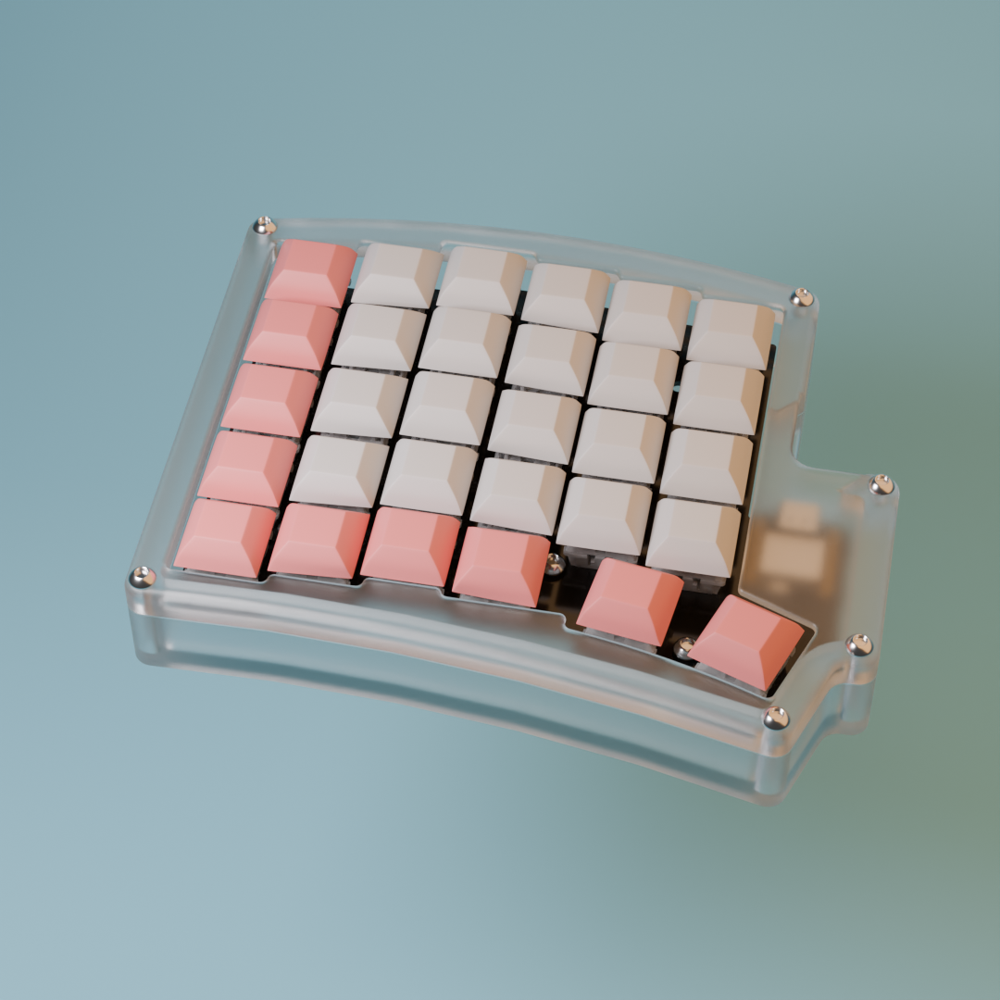
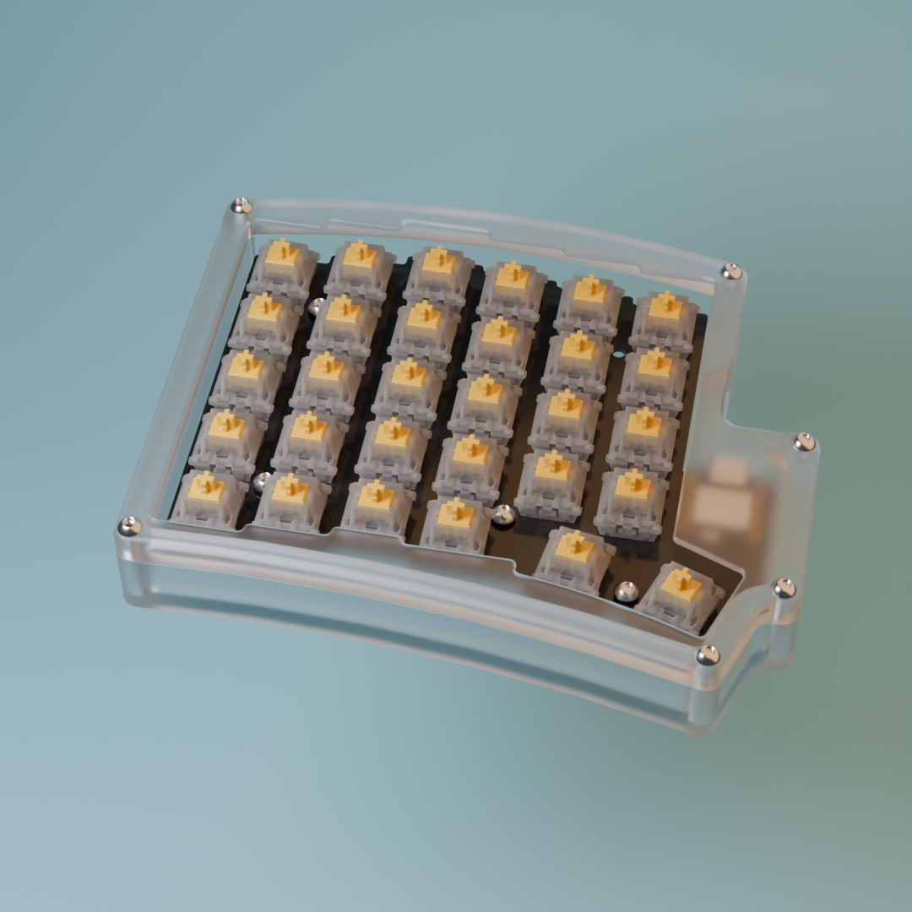
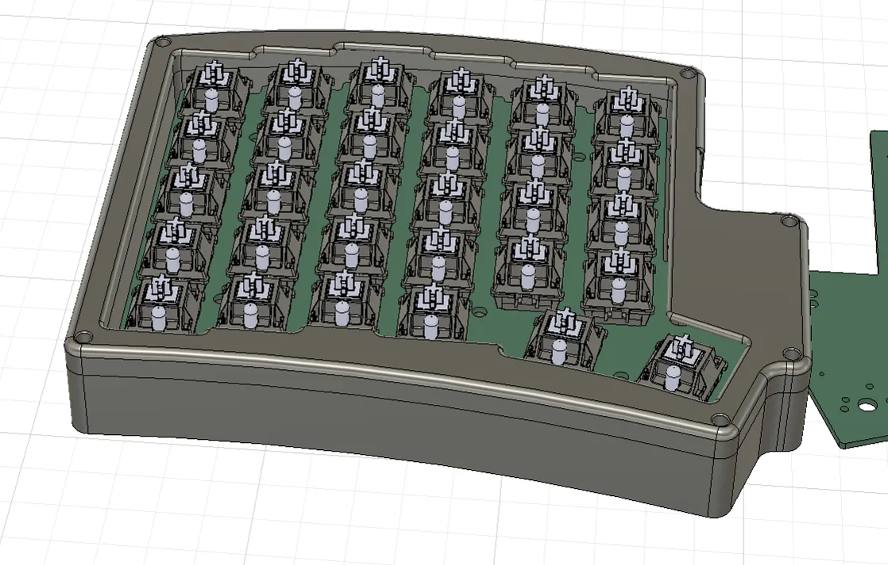
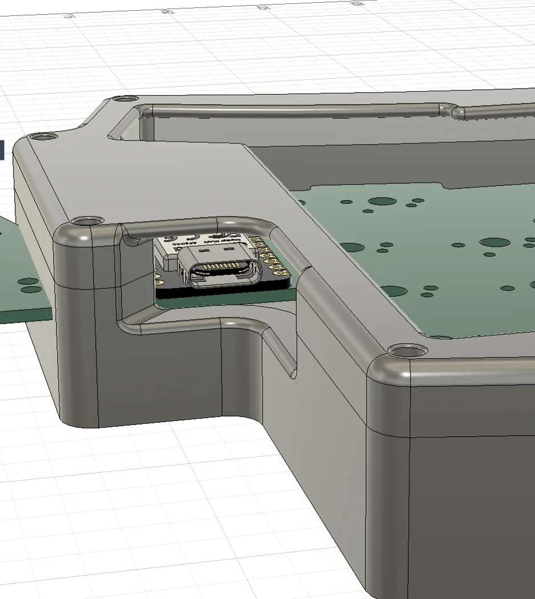
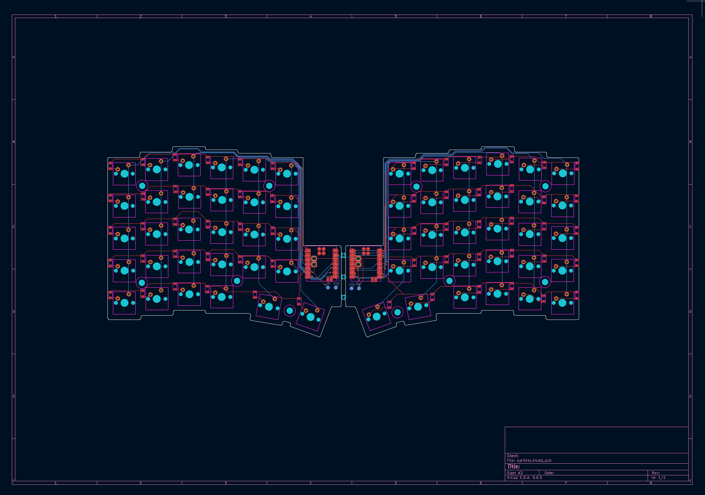
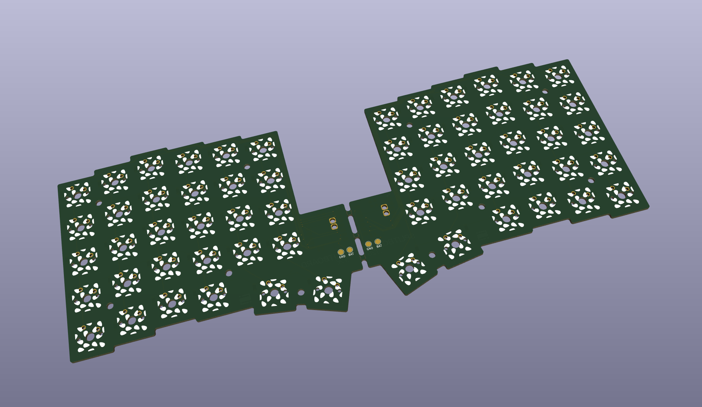
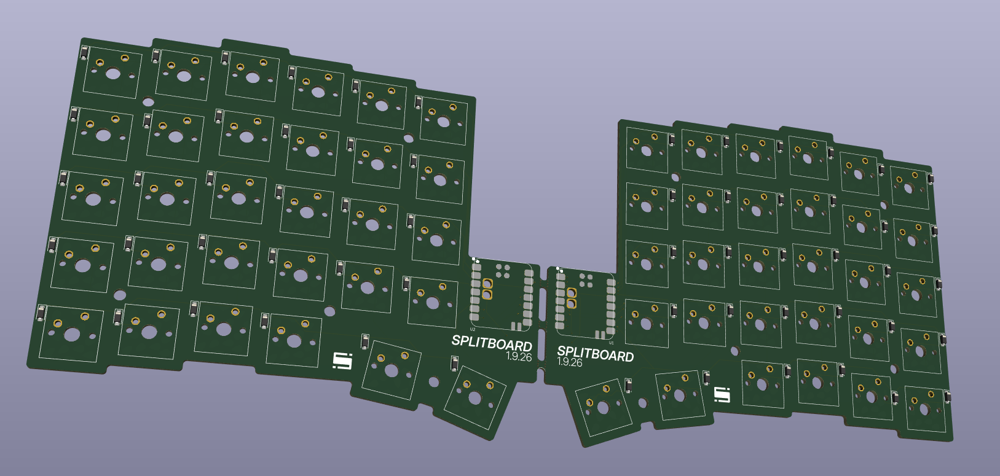
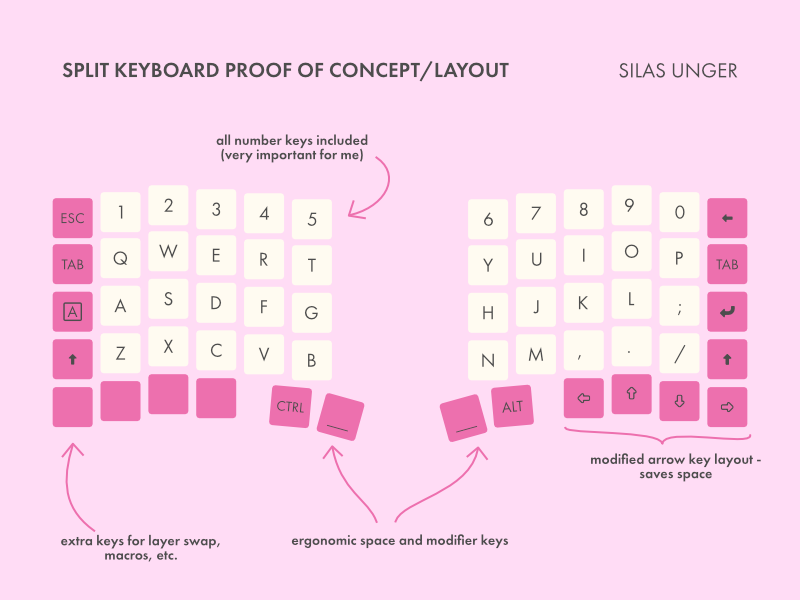

# SPLITBOARD
SPLITBOARD is a 60-key split keyboard with wireless capabilities. It has battery support, and can be connected via bluetooth to a computer. The keyboard runs off of a XIAO nrf52840, and I used all of the availible GPIO for the keyboard matrix.

This was created to help me become more familiar in CAD software as well as in PCB and firmware creation. I plan to use this as my everyday keyboard as I just use a laptop keyboard right now.

I am using CircuitPython along with the KMK library to run the firmware. Right now, the current firmware will be mapped to the right side, and I have not coded in wireless support yet.

## CAD

This project helped me learn how to use curves in Fusion 360. All CAD files were created in Fusion, and imported to Blender to create the final render above. I was able to use the PCB STEP files to make the design process much easier.

## PCB

PCB's were created in KICAD. I used a switch matrix, and the two test points connect to the battery power and ground.

## Firmware

Firmware uses the KMK library for CircuitPython. Currently, it will only work for the right side. Once I recieve the PCB's, I will finalize the firmware when I can test and iterate in real life.

Keymap:

## BOM

|Product Name                            |Link                                                |Vendor      |Quantity    |Total Price|
|----------------------------------------|----------------------------------------------------|------------|------------|-----------|
|PCB                                     |https://jlcpcb.com/                                 |JLCPCB      |5           |33.91      |
|M3 Heat-Set Inserts 4mm Length, 4.2mm OD|https://www.aliexpress.us/item/3256807473760054.html|AliExpress  |50          |1.83       |
|1N4148 Diodes                           |https://www.aliexpress.us/item/3256807350544438.html|AliExpress  |100         |1.3        |
|GATERON G Pro Milk Yellow Switches      |https://www.aliexpress.us/item/3256806600876158.html|AliExpress  |70          |15.24      |
|Keycap Set                              |https://www.aliexpress.us/item/3256810404509236.html|AliExpress  |1           |15.94      |
|MINI NRF52840 Development Board         |https://www.aliexpress.us/item/3256808382371220.html|AliExpress  |2           |18.92      |
|AliExpress Fees                         |https://aliexpress.us/                              |AliExpress  |1           |5.68       |
|                                        |                                                    |            |            |           |
|M3 Screws (6 - 16mm)                    |                                                    |Self-Sourced|2           |0          |
|3D Printed Parts (~300g)                |                                                    |Self-Sourced|4           |0          |
|LIPO Batteries                          |                                                    |Self-Sourced|2           |0          |
|                                        |                                                    |            |Total (USD):|92.82      |
